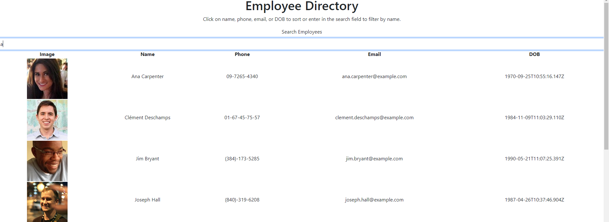

# Employee Directory

## Description
This is an employee directory view page built using react. It currently uses an api to generate random employees and allows a user to sort alphabetically by name as well as by date of birth, phone number or email. It also allows a user to narrow displayed results by searching for a specific string of characters. The page will display all employees with that string in their names.

## Built With

* [HTML](https://developer.mozilla.org/en-US/docs/Web/HTML)
* [CSS](https://developer.mozilla.org/en-US/docs/Web/CSS)
* [JS](https://www.javascript.com/)
* [GitHub](https://github.com/)
* [Git](https://git-scm.com/)
* [node.js](https://nodejs.org/en/)
* [npm](https://www.npmjs.com/)
* [Reactjs](https://reactjs.org/)
* [Bootstrap](https://getbootstrap.com/)

## Deployed Link

* [See Live Site](https://rslepejian.github.io/employee-directory/)

## Preview of Working Site



## Code Snippet
This code snippet shows the callback functino used in a Array.prototype.filter in order to have the page only display employees who have in their names a string that the user has searched for.

```javascript
    function filterer(employee){
    if (employee.name.toLowerCase().includes(developerState.search.toLowerCase())) {
      return true;
    }
    else {
      return false;
    }
  }
```

## Authors

* **Raffi Lepejian** 

## Contact Information

- [Link to Portfolio Site](https://rslepejian.github.io/updated-portfolio/)
- [Link to Github](https://github.com/rslepejian)
- [Link to LinkedIn](https://linkedin.com/in/raffi-lepejian-071876153)